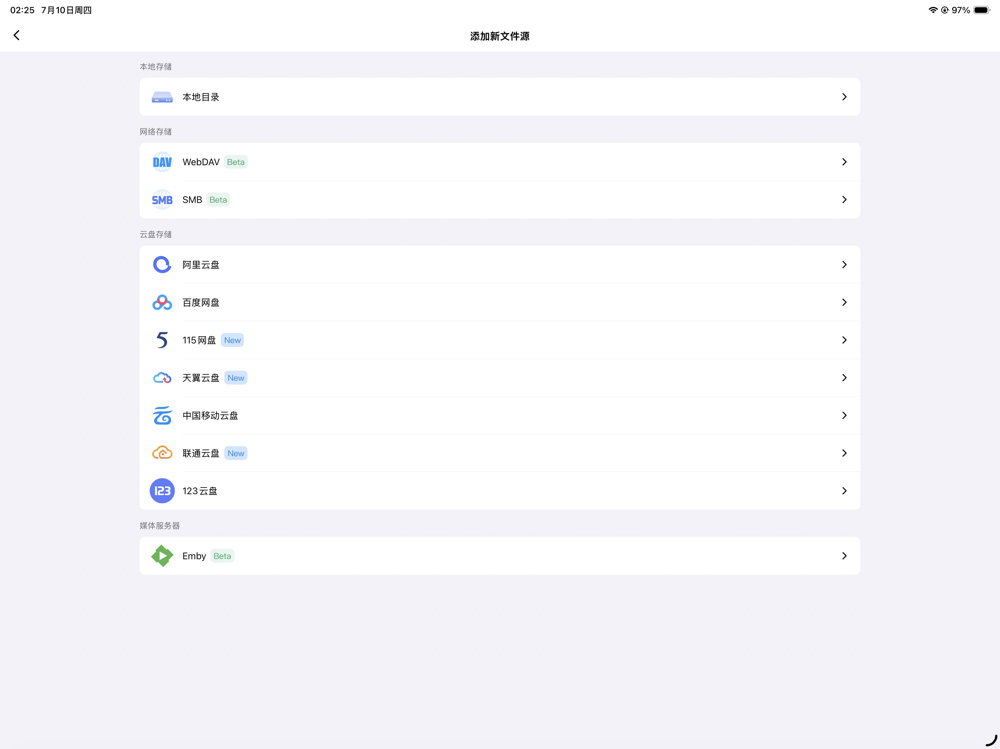

# [123云盘](https://www.123pan.com) 无限制挂载工具（使用教程文档）

## 目录

- [123云盘 无限制挂载工具（使用教程文档）](#123云盘-无限制挂载工具使用教程文档)
  - [目录](#目录)
  - [省流小助手](#省流小助手)
  - [在 Windows 文件资源管理器中挂载](#在-windows-文件资源管理器中挂载)
  - [在 网易爆米花(原Filmly) 中挂载](#在-网易爆米花原filmly-中挂载)
  - [在 OpenList(原Alist) 中挂载](#在-openlist原alist-中挂载)

## 省流小助手

- 和 WebDAV 的挂载方式完全一致，没有什么特别注意的

## 在 Windows 文件资源管理器中挂载

1. 在 `此电脑` 页面，单击鼠标右键，选择 `添加一个网络位置`

    

2. 一路点击 `下一步`，在 `Internet地址或网络地址` 处填写你配置好的 WebDAV 地址

    

3. 随后，账号密码分别填写 `settings.yaml` 中的 `WEBDAV_USERNAME` 和 `WEBDAV_PASSWORD` 项，注意区分大小写

4. 尽情享用！

    

## 在 网易爆米花(原Filmly) 中挂载

1. 添加新文件源，选择 `WebDAV` 协议

    

2. 所有参数正常填写，注意最后的 `路径` 留空不填

    

3. 耐心等待搜刮资源，然后尽情享用~

    

## 在 OpenList(原Alist) 中挂载

1. 没什么好说的，效果看图

    