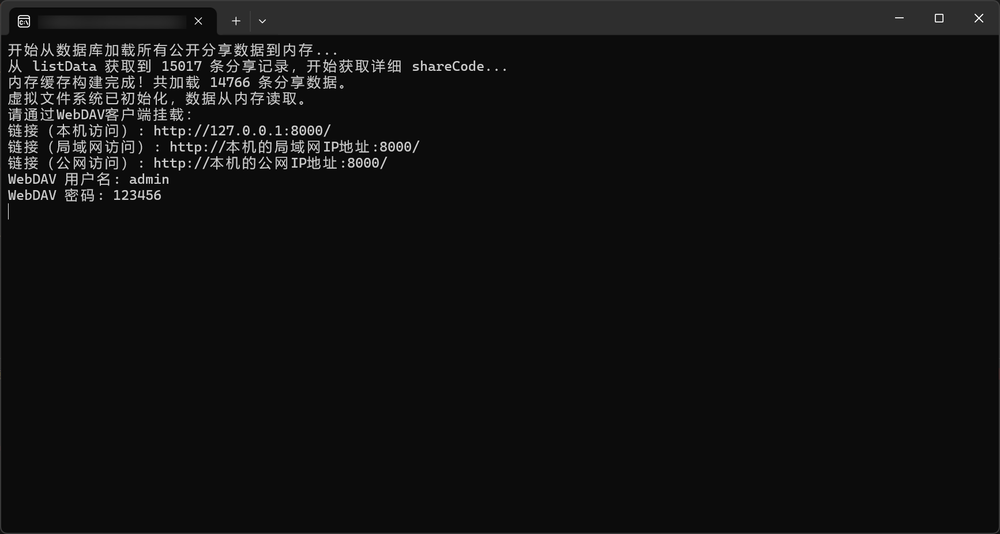

# [123云盘](https://www.123pan.com) 无限制挂载工具（Windows部署文档）

## 目录

- [123云盘 无限制挂载工具（Windows部署文档）](#123云盘-无限制挂载工具windows部署文档)
  - [目录](#目录)
  - [重要提示](#重要提示)
  - [一、解压文件](#一解压文件)
  - [二、配置文件](#二配置文件)
  - [三、运行程序](#三运行程序)
  - [四、开始使用](#四开始使用)

## 重要提示

- ⚠️ 建议仅本人使用，否则可能会出现奇怪的 Bug

## 一、解压文件

- 打包好的程序发布在 [GitHub Releases](https://github.com/realcwj/123Pan-Unlimited-WebDAV/releases) 中

- 下载最新版本的压缩包，解压后得到 `123Pan-Unlimited-WebDAV` 文件夹，文件夹内应该有一个 `main.exe` 文件、一个 `settings.yaml` 文件、以及一个 `PAN123DATABASE.db` 文件。

## 二、配置文件

- 打开 `settings.yaml` 文件，参考文档 [123云盘无限制挂载工具（配置参数介绍文档）](./SETTINGS.md) 修改配置

## 三、运行程序

- 双击 `main.exe` 文件即可运行程序

## 四、开始使用

- 网页地址请看程序运行窗口，例如

    

- 挂载到网易爆米花(Filmly)、VidHub、Infuse、Conflux等视频播放软件，或OpenList(原Alist)，请参考 [123云盘无限制挂载工具（使用教程文档）](./USAGE_TUTORIAL.md)